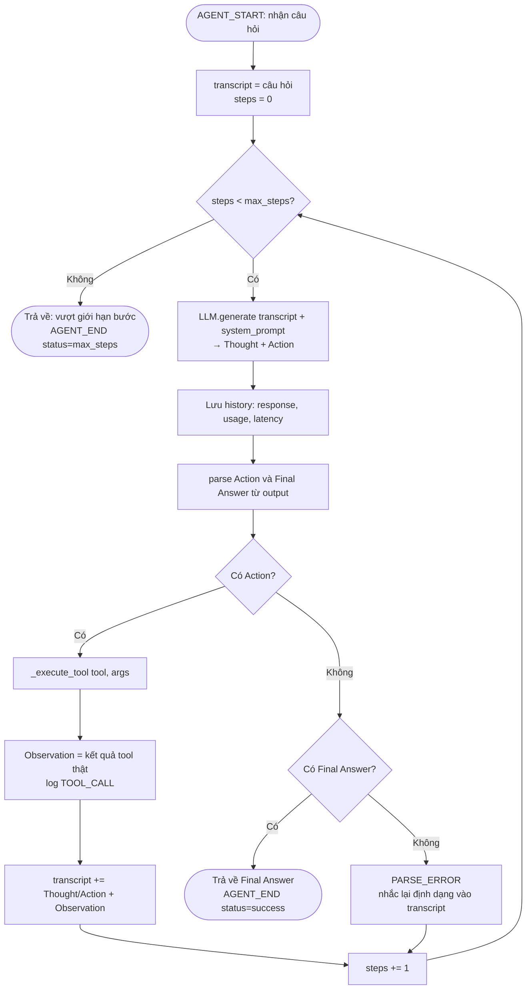

# Flowchart — Vòng lặp ReAct (P6)

Sơ đồ phản ánh đúng logic trong [`src/agent/agent.py`](../../src/agent/agent.py) `ReActAgent.run()`,
bao gồm cả bản vá **ưu tiên Action** (xem mục "Bug & Fix" cuối file).

## Mermaid



## ASCII (bản dự phòng nếu không render Mermaid)

```
            ┌────────────────────────────┐
            │  AGENT_START (câu hỏi)      │
            └──────────────┬─────────────┘
                           v
                 transcript=câu hỏi; steps=0
                           v
          ┌────────► steps < max_steps ? ──No──► "Vượt giới hạn bước"
          │                 │ Yes                   (AGENT_END=max_steps)
          │                 v
          │   LLM.generate → Thought + Action
          │                 v
          │     lưu history (usage, latency)
          │                 v
          │     parse Action & Final Answer
          │                 v
          │           Có Action ? ──Yes──► _execute_tool
          │                 │ No                │
          │                 v                   v
          │         Có Final Answer ?    Observation (kết quả thật)
          │            │        │               │  log TOOL_CALL
          │           Yes       No               v
          │            │        │       transcript += T/A + Obs
          │            v        v               │
          │   return Final   PARSE_ERROR        │
          │   Answer (done)  (nhắc định dạng)   │
          │                     │               │
          │                     v               v
          └──────────────── steps += 1 ◄────────┘
```

## Diễn giải

1. **Thought → Action → Observation** lặp lại: mỗi vòng LLM chỉ sinh suy luận + 1 lời gọi tool;
   agent thực thi tool và đưa **Observation thật** trở lại transcript. Đây là khác biệt cốt lõi
   so với chatbot (chatbot trả lời 1 phát, không có vòng kiểm chứng).
2. **Điều kiện dừng:**
   - `Final Answer` xuất hiện (và không kèm Action) → thành công.
   - Hết `max_steps` → trả thông báo timeout (tránh lặp vô hạn / cháy token).
3. **Xử lý lỗi:** nếu output không có cả Action lẫn Final Answer → `PARSE_ERROR`, agent nhắc lại
   định dạng và thử lại ở bước sau (self-correction).

## Bug & Fix (Debugging insight của P6)

**Triệu chứng:** với Gemini, agent dừng ngay sau **bước 1** và đưa câu trả lời chứa số liệu **bịa**
(ví dụ GPA 3.8 trong khi thật là 3.2), khung trace không có dòng `Observation`.

**Nguyên nhân:** Gemini xuất **cả `Action` lẫn `Final Answer`** (kèm `Observation` tự bịa) trong **một
lượt**. Vòng lặp cũ kiểm tra `Final Answer` **trước** → return ngay, **tool không bao giờ chạy**.

**Fix:** đảo thứ tự — **ưu tiên thực thi Action**; chỉ chấp nhận `Final Answer` khi không còn Action.
Kèm siết system prompt: *"Mỗi lượt chỉ một Thought + một Action rồi DỪNG; không tự viết Observation/
Final Answer"*. Sau fix, đúng câu hỏi đó chạy đủ **5 bước** với GPA thật 3.2.
```
get_student_record → check_prerequisite → calculate_tuition → apply_scholarship → Final Answer
```
